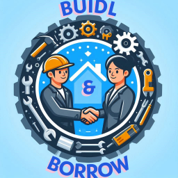
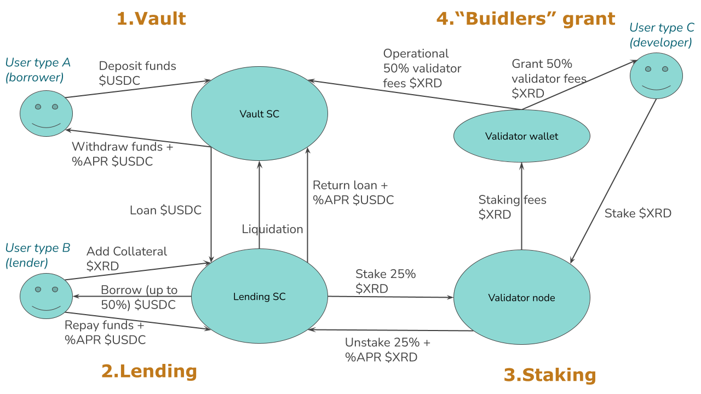

# Buidl & Borrow

This is the documentation && source code of **Build & Borrow**, built on Radix DLT.

## Table of Content

  * [💻 Project introduction](#Project introduction)
     + [Project tagline](#Project tagline)
     + [Project description](#Project description)
     + [Overview](#Overview)
     + [MVP Project Features](#MVP)
     + [Roadmap](#Roadmap)
  * [🚀 Quick start](#Quick start)
  * [👥 Contributing](#Contributing)
  * [Submission form](#Submission form)
    
## 💻 Project introduction

### Project tagline

Build & Borrow is the lending platform to be integrated in other Radix projects. The mission is to offer a new Lending & Borrowing Money Market that at the same time adds value to the Radix DLT ecosystem through Liquid Staking & Restaking and supports the communitty with Grants for "buidlers".

### Project description

A DeFi Lending protocol with the vision to add value to the whole Radix DLT ecosystem. integrated in other DeFi projects and also
and add value in the whole Radix DLT ecosystem.

To accomplish this vision, it is composed by 4 pillars:
 1. Vault. Users can borrow their XRD and obtain interest %APR from the vault revenue.
 2. Lending. Users can lend STABLECOIN and use it for trading, increasing the number of transactions in the network and increasing the 24h volume value in the trading markets.
 4. Staking. Created our own validator node to increase the transaction per second that the network can process. At the same time, the vault and the lending protocol stake the exceed of $XRD in our validator, increasing the security of the network.
 5. "Buidlers" grants. 50% of the benefits of the validator node goes to a grant program, exclusive for the projects that integrates our protocol by using our lending smart contract, staking $XRD in our validator or using our node as gateway to post/get transacions. This helps to grow the ecosystem and supports the Radix API ge

And the project interacts with 3 types of users, giving utility to all kind of profiles in the network:
 a. Borrower. Community and hodler profile.
 b. Lender. DeFi and trader profile.
 c. Project developer. Builder profile.

### Overview

Graphical diagram of the whole project circularity.

https://docs.google.com/presentation/d/1w-HwvmPlJstPeslL8WXWIGs6wUulcR56/edit?usp=sharing&ouid=103814174963912216601&rtpof=true&sd=true

### MVP Project Features:

* **Add collateral** - Allows users to deposit collateral into the vault to be locked away and used to overcollaterize their loan(s).
* **Borrow** - Allows users to borrow from the vault with a max borrow of 50%.
* 
* **Deposit** - Allows users to deposit liquidity into the lending vault and earn protocol fees.
* **Repay** - Allows users to repay their loan in partial or in full.
* 
* **Liquidate** - Allows users to liquidate any loans that have a Health Factor of 1 or below.

* **Validator node** - Collaborate with the infrastructure with our own validator node and help to secure the network.
* **Buidlers grant** - The project dedicates 50% of the validator fees to grant project developers that uses our node.

  
### Roadmap

1. Hackathon 2024:
   - MVP version.
   - Modules: Lending platform, using the founders liquidity, and a Validator node, manually integrated with the Lending.
   - Deployed on Stokenet.
3. Q4 2024:
   - Lending platform and Validator node integrated automatically.
   - Deploy on Mainnet.
5. S1 2025:
   - Incorporate the "Buidlers" Grants module.
7. S2 2025:
   - Incorporate the Vault module.

## Quick start

Check document QuickStart.md

## Contributing

Contributions are what make the open source community such an amazing place to be learn, inspire, and create. Any contributions you make are **greatly appreciated**.

One can contribute by creating _pull requests_, or by opening _issues_ for discovered bugs or desired features.

1. Fork the Project
2. Create your Feature Branch (`git checkout -b feature/AmazingFeature`)
3. Commit your Changes (`git commit -m 'Add some AmazingFeature'`)
4. Push to the Branch (`git push origin feature/AmazingFeature`)
5. Open a Pull Request

If you're a smart contract developer/project building on Radix DLT or just a user, don't hesitate to [DM us on GitHub]([https://github.com/IvanBodnarash/buidl-n-borrow-dapp]).

## Submission form

- Form
[https://form.typeform.com/to/n25zhCC6](https://form.typeform.com/to/n25zhCC6)

 - Logo

 - Project Tagline This question is required.*
Provide a precise description of your project's vision (Max. 300 characters).

 - Project Description This question is required.*
Fill in the details about your project.

 - Video Demo - Project PitchThis question is required.*
Please submit a video demo where you explain the problems your team is trying to solve and your solution, and highlight the project key features and functionality (Max. 5 minutes).

 - Video Demo - Code Go-throughThis question is required.*
Please submit a video demo where you explain and walk through your GitHub codes (Max. 15 minutes).

 - Github Repo URL This question is required.*

 - Team formation This question is required.*
